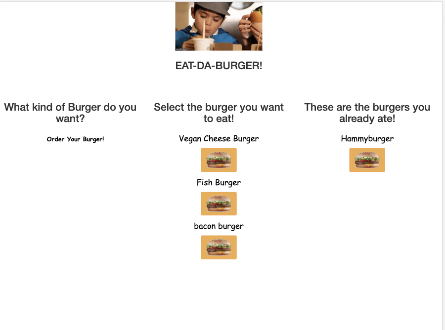
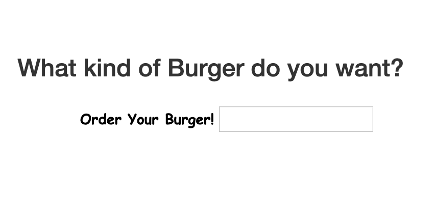
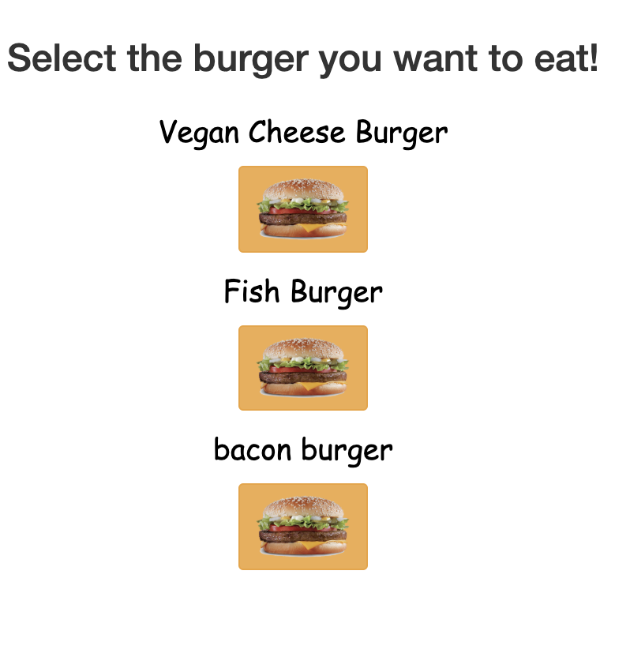
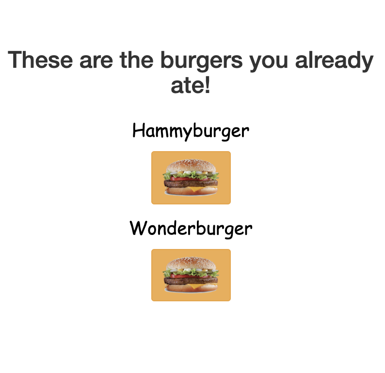

#  Eat-Da-Burger
Overview:

Welcome to Eat-Da-burger. Enjoy burgers from preset menu or create your own!

still need to finish this and add screenshots

# Technologies Used:
 * MySQL

* Programming Language:
    * Javascript
    * Handlebars
    * Node 

# Instructions:
Eating a burger is easy, just follow these steps

* 1)Step One is to enter the main page through this link (https://rjburger2.herokuapp.com/burger). Once you enter the site it should look like this 

* 2)Once you have entered the site click the "Order your burger" button and enter a kind of burger you would like 

* 3)Your burger will populate, then click on your burger and you can eat it 

* 4) Once you eat a burger, it will go into the column with burgers you have eaten 

## Link to deployed site:
(https://rjburger2.herokuapp.com/burger) 
